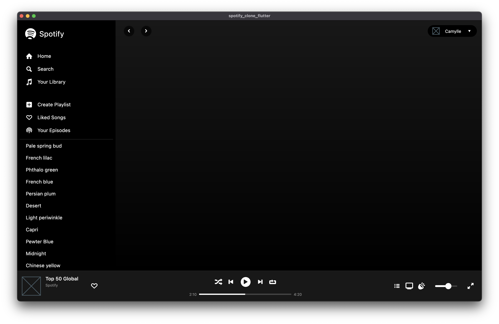

# Spotify Clone Flutter

This is a challenge project.
The goal is to clone de Spotify UI (not features).

## Screenshots




## How to run

- First install Flutter SDK

```bash
# linux
sudo snap install flutter --classic

# mac
brew cask install flutter

# windows
choco install flutter
```

- Clone this repository

```bash
git clone https://github.com/HenriqueNas/spotify_clone_flutter
```

- Then run the following commands:

```bash
flutter pub get
flutter run
```
